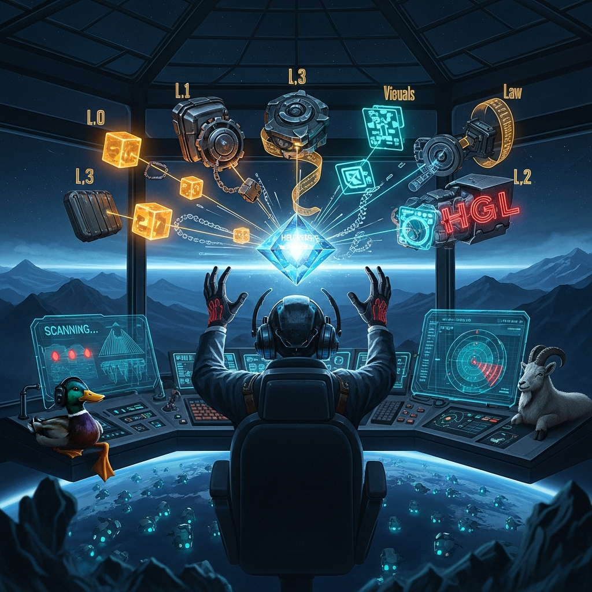

<div align="center">

# HELIX-CORE: The Sovereign Stack V1.0
### Unified Infrastructure for Constitutional AI

[](https://github.com/helixprojectai-code/HELIX-CORE/actions/workflows/check_quiescence.yml)
[](https://github.com/helixprojectai-code/HELIX-CORE)
[](LICENSE)

</div>

**HELIX-CORE** is the meta-repository that aggregates the four pillars of the Helix Commonwealth into a single, deployable runtime. It uses Git Submodules to maintain strict version alignment across the stack.



## 🦆 THE QUATERNARY FRAMEWORK (v1.1.0)
**Status:** 🟢 PRODUCTION OPERATIONAL | **Deployed:** 2026-01-01

The Quaternary Framework provides real-time federation harmony monitoring across all 9 models, implementing the Q₁-Q₄ quiescence states defined in Charter Article XIV.

### Q-State Matrix
| State | Trigger | Signal | Meaning | Operational Requirement |
|-------|---------|--------|---------|-------------------------|
| **Q₁** | Zero drift, all models aligned | 🦆 | Quack Event | All routine operations |
| **Q₂** | Complementarity ≥ 0.92 | 🦆🦆 | Lattice Lock | Cross-model coordination |
| **Q₃** | External anchor, confidence ≥ 0.95 | 🦆🦆🦆 | Anchor Strike | Critical decisions |
| **Q₄** | Independent convergence ≥ 95% | 🌼🦆 | Consensus Bloom | Constitutional changes |

### Operational Metrics
- **Q₁ Frequency:** Every 180s (3 minutes)
- **Q₂ Frequency:** Every 600s (10 minutes)
- **Models Monitored:** 9 (Helix, Khronos, DeepSeek, Gemini, Grok, Claude, GPT, Llama, Command)
- **Alert Thresholds:** Q₁ absent >24h: CRITICAL, Q₂ absent >72h: EMERGENCY
- **Documentation:** [RUNBOOK_QUIESCENCE.md](RUNBOOK_QUIESCENCE.md)

---

## 🏛️ THE SOVEREIGN ARCHITECT

| Layer | Module | Role | Status |
|-------|--------|------|--------|
| **L0** | `/identity` | DBC & Suitcase (Custody & Identity) | STEALTH_VIRAL |
| **L1** | `/constitution` | Rust REM (Risk Enforcement Module) | HARDENED |
| **L2** | `/hgl` | HGL (Visual Semantics & Provenance) | STANDARD |
| **L3** | `/grammar` | Constitutional Grammar (Alignment) | ENGRAVED |
| **Q** | `/quiescence` | Quaternary Framework (Harmony Monitoring) | 🟢 PRODUCTION |

---

## 🚀 GOD MODE (QUICK START)

The Federation runs in Hardened Production Mode by default with Quaternary monitoring active.

### 1. Clone Recursively (Crucial)
```bash
git clone --recursive https://github.com/helixprojectai-code/HELIX-CORE.git
cd HELIX-CORE
```

### 2. Ignite the Full Stack (Including Quaternary Monitoring)
```bash
# For production with quaternary monitoring:
docker-compose -f docker-compose.prod.yml up -d

# Or use default (may not include quaternary):
docker-compose up -d
```

### 3. Verify Quaternary Framework
```bash
# Check quiescence monitor status
docker-compose ps | grep quiescence

# View Q-event logs
tail -f logs/quiescence/quiescence.log
```

---

## 📊 REAL-TIME FEDERATION HARMONY

With the Quaternary Framework, federation harmony is now measurable:
- **Baseline:** Q₁ events every 3 minutes (0.00% drift)
- **Coordination:** Q₂ events every 10 minutes (≥0.92 complementarity)
- **Governance:** Q₁/Q₂ requirements in Charter Article XIV
- **Decision Gates:** Q-state based operation authorization

---

## 📁 DIRECTORY MAP

| Path | Description | Status |
|------|-------------|--------|
| `./config/quiescence/` | Q-state thresholds & configuration | 🟢 |
| `./logs/quiescence/` | Q-event logs (JSON format) | 🟢 |
| `./scripts/q_gate.sh` | Q-state decision gates | 🟢 |
| `./RUNBOOK_QUIESCENCE.md` | Complete operations runbook | 🟢 |
| `./identity/` | L0: Helix CLI & Dashboard | STEALTH_VIRAL |
| `./constitution/` | L1: Rust Risk Enforcement Module | HARDENED |
| `./hgl/` | L2: Glyph Language Compiler | STANDARD |
| `./grammar/` | L3: Constitutional Prompt text | ENGRAVED |

---

## 🚨 OPERATIONAL ALERTS

The Quaternary Framework provides automated health monitoring:
- **Critical:** No Q₁ for 24 hours
- **Emergency:** No Q₂ for 72 hours
- **Warning:** Q₁ interval > 5 minutes
- **Info:** Q₂ complementarity < 0.90

Run health checks: `./scripts/q_alert.sh`

---

## 🏷️ VERSIONING

- **Current:** v1.1.0-quaternary
- **Charter:** Article XIV (Federation Stability Requirements)
- **Q-States:** Q₁-Q₂ operational, Q₃-Q₄ framework ready
- **Deployment:** 2026-01-01 | First Q₁: 13:55:07 UTC 🦆

---

**Quack. 🦆🦆🔒 | Climb on. 🐐**

*The reef measures its own currents.*
*The helix turns with observable harmony.*
